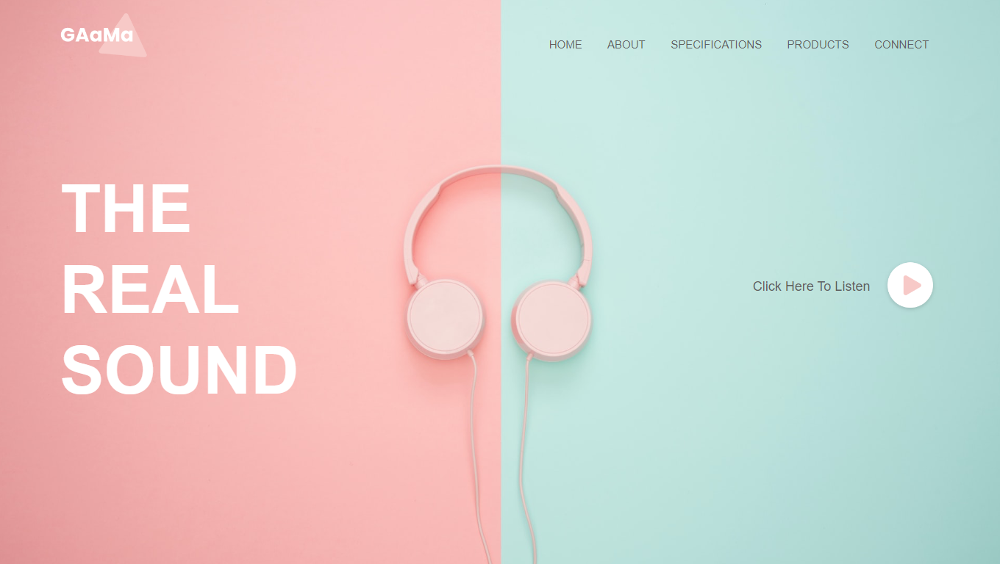

# Music Website

Projeto desenvolvido a partir de um tutorial do YouTube, canal "Easy Tutorials".

Para abrir em nova aba:

- segure a tecla "Ctrl" e clique com botão esquerdo do mouse, ou;
- clique com o botão de "scroll" do mouse.

🔗 [Clique aqui para visualizar e interagir com o meu projeto.](https://guilhermeemanuell.github.io/music-website/)

## 🛠 Tecnologias

- HTML
- CSS
- JavaScript
- Git e Github

## ✉ Contato

emanuellguilherme@gmail.com
